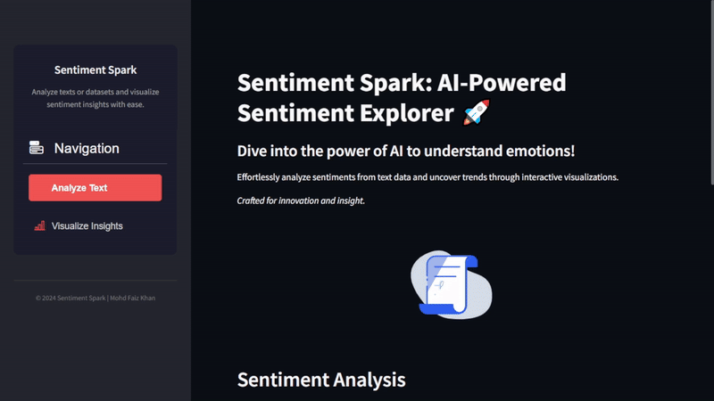
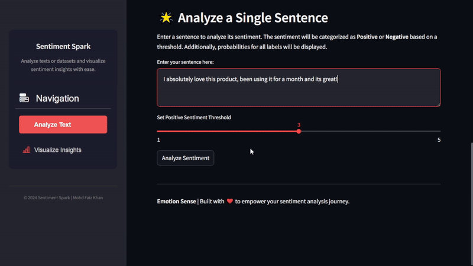
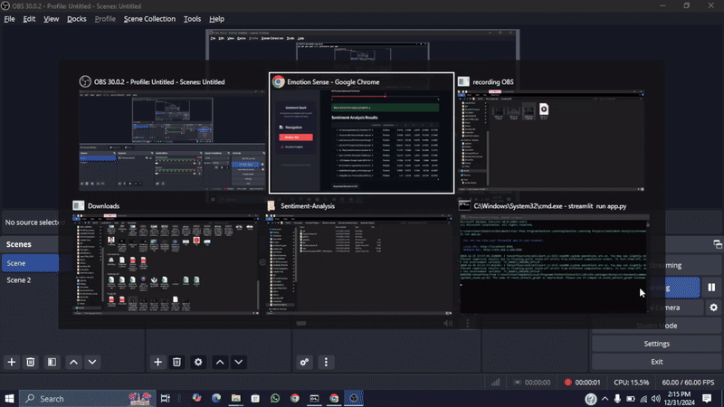
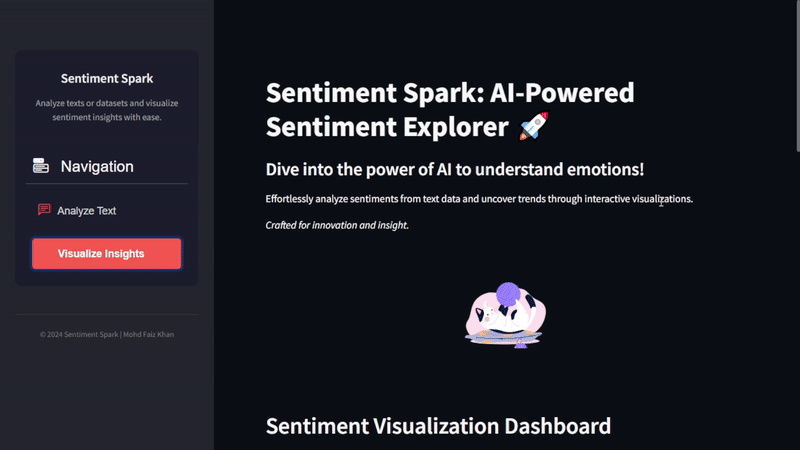

# 🌟 Sentiment Spark  

  

Single Review Analysis

  

Dataset Analysis Results

  

Visualization

  

## 🎯 Overview  
**Sentiment Spark** is a deep learning-based sentiment analysis tool powered by **BERT Multilingual** from Hugging Face. It can analyze text reviews, classify sentiments on a scale of **1 to 5**, and provide detailed insights with interactive visualizations.  

## ✨ Features  
- **Single Review Analysis**: Analyze individual sentences or reviews and get a sentiment score (1 = very dissatisfied, 5 = extremely satisfied).  
- **Batch Analysis**: Upload an **Excel/CSV file**, and get predictions for the entire dataset, including:  
  - **Sentiment Class (1-5)**  
  - **Classification (Positive/Negative)** based on a user-defined threshold  
  - **Probability Distribution for Classes (1-5)**  
- **Threshold-Based Classification**: Define a threshold (e.g., above 3 = Positive).  
- **Interactive Visualizations**: Auto-generated interactive charts using Plotly for clear insights.  

## 🛠️ Built With  
- **Deep Learning**: BERT Multilingual from Hugging Face Transformers  
- **Web App**: Streamlit for rapid and user-friendly interface development  
- **Visualizations**: Plotly for dynamic and interactive charts  

## 🚀 How to Use  

### 1. Clone the Repository  
```bash
git clone https://github.com/yourusername/sentiment-spark.git
cd sentiment-spark
```

### 2. Run the Application
```bash
streamlit run app.py
```

### 3. Input Your Data
- **Single Review**: Enter a sentence or review for instant analysis.
- **Dataset Upload**: Upload an Excel or CSV file for batch analysis.

### 4. View Results
- Sentiment score (1-5)
- Positive/Negative classification (based on threshold)
- Probability distribution for all classes
- Interactive visualizations

📊 Sample Outputs
Dataset Analysis Results
| Sentiment | Classification | Probability (1) | Probability (2) | Probability (3) | Probability (4) | Probability (5) |
|-----------|----------------|------------------|------------------|------------------|------------------|------------------|
| 5         | Positive       | 0.01            | 0.02            | 0.05            | 0.12            | 0.80            |


🖼️ Visualizations
Sentiment Spark generates interactive charts like:
- Sentiment distribution
- Sentiment Breakdown by Classification
- Average Probability Distribution per Sentiment

🤝 Contributions

Feel free to fork this repository, submit issues, or make pull requests to enhance the project.

📜 License

This project is licensed under the MIT License.

🌟 Acknowledgments

Thanks to Hugging Face, Streamlit, and Plotly for their incredible tools and resources.
